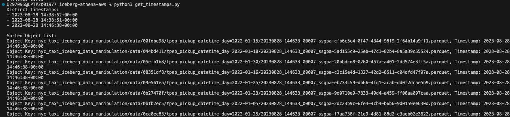
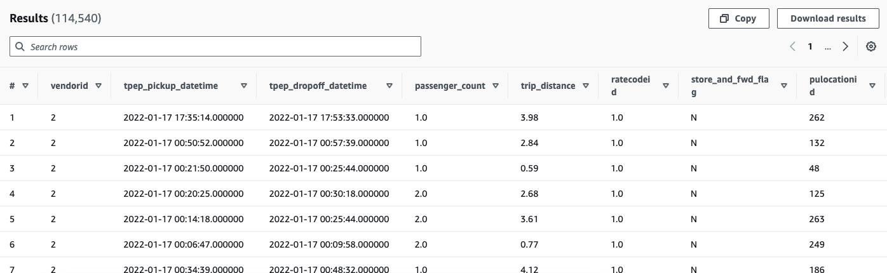
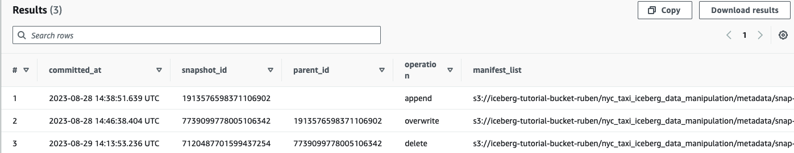

# Apache Iceberg on AWS

## Table of contents

- [What's included](#whats-included)
- [Set Up Work](#set-up)
- [Main Tutorial](#main-tutorial)
- [Useful Links](#useful-link)
- [Creators](#creators)

## What's included

The repo is to supplement the [youtube video](https://youtu.be/iGvj1gjbwl0) on Iceberg in AWS.

## Set up

1. Run the cloud formation template. This will create;
- The S3 bucket
- Glue database
- Athena work group

using cloudformation with cli:
```
aws cloudformation create-stack \                                              
    --stack-name ruben-iceberg \
    --template-body file://cf_reasources.yaml \
    --region eu-west-1 \
    --parameters ParameterKey=S3PySparkBucketName,ParameterValue=iceberg-tutorial-bucket-ruben
```

```
aws cloudformation describe-stacks --stack-name ruben-iceberg --region eu-west-1
```


2. Upload the data from the `data` folder

```
aws s3 cp data/csv/taxi.csv s3://iceberg-tutorial-bucket-ruben/csv/
```

## Main Tutorial
1. Upload the CSV data from `./data/csv`
2. Create the CSV table using athena
    ```
    CREATE EXTERNAL TABLE
      iceberg_tutorial_db.nyc_taxi_csv
      (
            vendorid bigint,
            tpep_pickup_datetime timestamp,
            tpep_dropoff_datetime timestamp,
            passenger_count double,
            trip_distance double,
            ratecodeid double,
            store_and_fwd_flag string,
            pulocationid bigint,
            dolocationid bigint,
            payment_type bigint,
            fare_amount double,
            extra double,
            mta_tax double,
            tip_amount double,
            tolls_amount double,
            improvement_surcharge double,
            total_amount double,
            congestion_surcharge double,
            airport_fee double
      )
      ROW FORMAT DELIMITED
      FIELDS TERMINATED BY ','
      STORED AS TEXTFILE
      LOCATION 's3://<s3-bucket-name>/csv/';
    ```
3. Create an Apache Iceberg table
    ```
    CREATE TABLE
      iceberg_tutorial_db.nyc_taxi_iceberg 
      (
            vendorid bigint,
            tpep_pickup_datetime timestamp,
            tpep_dropoff_datetime timestamp,
            passenger_count double,
            trip_distance double,
            ratecodeid double,
            store_and_fwd_flag string,
            pulocationid bigint,
            dolocationid bigint,
            payment_type bigint,
            fare_amount double,
            extra double,
            mta_tax double,
            tip_amount double,
            tolls_amount double,
            improvement_surcharge double,
            total_amount double,
            congestion_surcharge double,
            airport_fee double
      )
      PARTITIONED BY (day(tpep_pickup_datetime))
      LOCATION 's3://<s3-bucket-name>/nyc_taxi_iceberg/'
      TBLPROPERTIES ( 'table_type' ='ICEBERG'  );
    ```
4. Create a 2nd Apache Cceberg table for updating data
    ```
    CREATE TABLE
      iceberg_tutorial_db.nyc_taxi_iceberg_data_manipulation 
      (
            vendorid bigint,
            tpep_pickup_datetime timestamp,
            tpep_dropoff_datetime timestamp,
            passenger_count double,
            trip_distance double,
            ratecodeid double,
            store_and_fwd_flag string,
            pulocationid bigint,
            dolocationid bigint,
            payment_type bigint,
            fare_amount double,
            extra double,
            mta_tax double,
            tip_amount double,
            tolls_amount double,
            improvement_surcharge double,
            total_amount double,
            congestion_surcharge double,
            airport_fee double
      )
      PARTITIONED BY (day(tpep_pickup_datetime))
      LOCATION 's3://<s3-bucket-name>/nyc_taxi_iceberg_data_manipulation/'
      TBLPROPERTIES ( 'table_type' ='ICEBERG'  );
    ```
5. Insert from CSV table to Iceberg format
    ```
    INSERT INTO iceberg_tutorial_db.nyc_taxi_iceberg
    SELECT 
    *
    FROM "iceberg_tutorial_db"."nyc_taxi_csv" ;
    ```
6. Run a query to look at the Day partition to see how Iceberg works
    ```
    SELECT * FROM nyc_taxi_iceberg WHERE day(tpep_pickup_datetime) =  5 limit 20;
    ```
7. Insert into another Iceberg table for data manipulation
    ```
    INSERT INTO nyc_taxi_iceberg_data_manipulation
    SELECT * FROM nyc_taxi_iceberg;
    ```
8. Update some data to see the change take place 
    ```
    UPDATE nyc_taxi_iceberg_data_manipulation SET passenger_count = 4.0 WHERE vendorid = 2 AND year(tpep_pickup_datetime) =2022;
    ```
9. Select the updated data
    ```
    SELECT * FROM nyc_taxi_iceberg_data_manipulation WHERE vendorid = 2 and year(tpep_pickup_datetime) =2022 limit 10;
    ```
10. Time travel query

    You need to get the right timestamp. With step 9 you can see the current data. with time travel you can view the data how it was at a specific timestamp. To get these timestamps you can look into the s3 bucket in the metadata files. Or you can run the get_timestamps.py to get the timestamps to include into the following query. Make sure you change the bucket_name and folder_prefix according to your settings.

    Using the get_timestamps.py
    

    ```
    SELECT * FROM nyc_taxi_iceberg_data_manipulation 
    FOR TIMESTAMP  AS OF TIMESTAMP '2023-08-28 14:46:38+00:00' 
    WHERE vendorid = 2 and year(tpep_pickup_datetime)= 2022 
    ```

    Example result:
    This shows the result before the data was changed.
    Query used:
    ```
    SELECT * FROM nyc_taxi_iceberg_data_manipulation 
    FOR TIMESTAMP AS OF TIMESTAMP '2023-08-28 14:46:38+00:00' 
    WHERE vendorid = 2 and year(tpep_pickup_datetime)= 2022
    ```

    

    AWS docs reference: https://docs.aws.amazon.com/athena/latest/ug/querying-iceberg-table-data.html

11. Delete from iceberg table
    ```
    DELETE FROM nyc_taxi_iceberg_data_manipulation WHERE year(tpep_pickup_datetime) = 2008; 
    ```

12. Check the snapshots that were created
    ```
    SELECT * FROM "iceberg_tutorial_db"."nyc_taxi_iceberg_data_manipulation$snapshots"
    ```

    example output:
    
# WIP RUBEN

## Problems with tables without iceberg using Athena

- UPDATE is not supported
- DELETE is not supported
- ALTER TABLE not supported: for example if you want to update values you could do it in a values_updated column, drop the old_column and rename the values_updated to the old_column


## Do an update without iceberg
usinv csv table as example

### update not supported in Athena without iceberg
Updates are not supported in Athena with csv tables

try to run:

```
UPDATE nyc_taxi_csv SET passenger_count = 4.0 WHERE vendorid = 2 AND year(tpep_pickup_datetime) =2022;
```

you will get an error:

Failed: NOT_SUPPORTED: Modifying Hive table rows is only supported for transactional tables
This query ran against the "iceberg_tutorial_db" database, unless qualified by the query. Please post the error message on our forum  or contact customer support  with Query Id: ba48c590-32fe-4cef-866e-b96b54fa2996

### create tmp table with updated data

#### get column_names
```
-- Retrieve column names as a single comma-separated value
SELECT array_join(array_agg(column_name), ', ')
FROM information_schema.columns
WHERE table_name = 'updated_nyc_taxi' AND column_name != 'passenger_count'; 
```
#### manually insert column names here
```
-- Create a new table with updated passenger_count values
CREATE TABLE updated_nyc_taxi AS
SELECT
  vendorid, tpep_pickup_datetime, tpep_dropoff_datetime, trip_distance, ratecodeid, store_and_fwd_flag, pulocationid, dolocationid, payment_type, fare_amount, extra, mta_tax, tip_amount, tolls_amount, improvement_surcharge, total_amount, congestion_surcharge, airport_fee,
  CASE
    WHEN vendorid = 2 AND year(tpep_pickup_datetime) = 2022 THEN 4.0
    ELSE passenger_count
  END AS passenger_count -- Keep the column name as passenger_count
FROM
  "nyc_taxi_csv";
```

#### validate if passenger count is 4
```
SELECT * FROM updated_nyc_taxi WHERE vendorid = 2 and year(tpep_pickup_datetime) =2022 limit 10;
```

### delete the old table
```
DROP TABLE nyc_taxi_csv;
```

### copy table with updated content 
```
CREATE TABLE nyc_taxi_csv AS
SELECT * FROM updated_nyc_taxi;
```

### delete the temp table
```
DROP TABLE `updated_nyc_taxi`;
```


## TODO: 
- EMR https://aws.amazon.com/blogs/big-data/use-apache-iceberg-in-a-data-lake-to-support-incremental-data-processing/
- map the cases to iceberg capabilities: ACID transactions, upserts and deletes, latest state, query performance, time travel (or is this latest state?; is latest state part of ACID transactions?)
- Glue
- OPTIMIZE and VACUUM
- more: https://docs.aws.amazon.com/athena/latest/ug/querying-iceberg-additional-resources.html


## Creators

**Johnny Chivers**

- <https://github.com/johnny-chivers/>

## Useful Links

- [youtube video](https://youtu.be/iGvj1gjbwl0) 
- [website](https://www.johnnychivers.co.uk)
- [buy me a coffee](https://www.buymeacoffee.com/johnnychivers)


Enjoy :metal:
